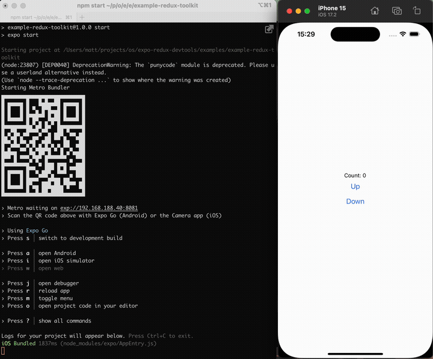

# Redux DevTools for Expo (or React Native)

The full [Redux DevTools](https://github.com/reduxjs/redux-devtools/) (from the Chrome extension) as an Expo Dev Plugin.

- Easy to install and run.
- Live list of actions and how it affects the state.
- Ability to rewind, replay, and dispatch actions from the devtools.



## Installation

This package requires that [Expo Dev Plugins](https://docs.expo.dev/debugging/devtools-plugins/) are available. If you are using Expo 50 or above then it will already be available. It will work with either [Expo Go](https://docs.expo.dev/get-started/expo-go/) or [Development Builds](https://docs.expo.dev/develop/development-builds/introduction/).

For bare React Native projects, you must ensure that you have [installed and configured the `expo` package](https://docs.expo.dev/bare/installing-expo-modules/) before continuing.

### Install the package

If you are setup with Expo Dev Plugins, then you can install the package using these commands and then follow the usage guide below.

```
npm install redux-devtools-expo-dev-plugin
```

or with Yarn:

```
yarn add redux-devtools-expo-dev-plugin
```

### Link the DevTools to Redux

There are multiple ways of using this package depending if you're using Redux Toolkit or legacy Redux.

#### Using Redux Toolkit

You need to modify your call to `configureStore` to disable the built in devtools (by passing in `devTools: false`) and add in the Expo Devtools plugin enhancer (by concatenating the `devToolsEnhancer()`).

Your call to `configureStore` will end up looking like this:

```javascript
import devToolsEnhancer from "redux-devtools-expo-dev-plugin";

const store = configureStore({
  reducer: rootReducer,
  devTools: false,
  enhancers: (getDefaultEnhancers) =>
    getDefaultEnhancers().concat(devToolsEnhancer()),
});
```

The `enhancers` property will call `getDefaultEnhancers()` to get the default enhancers from Redux Toolkit and then concatenate the `devToolsEnhancer` to the end. If you already have some other enhancers, such as the one for Redux Saga, then you should make sure `devToolsEnhancer` is the last in the list.

You can also pass in options for the `devToolsEnhancer` such as:

```javascript
devToolsEnhancer({ trace: true });
```

#### Legacy installation with `redux` package

If you have the legacy basic [store](http://redux.js.org/docs/api/createStore.html) as described in the official [redux-docs](http://redux.js.org/index.html) then the installation is as follows:

<details>
<summary>Click me to view the legacy installation instructions</summary>

If you have the legacy basic [store](http://redux.js.org/docs/api/createStore.html) as described in the official [redux-docs](http://redux.js.org/index.html), simply replace:

```javascript
import { createStore } from "redux";
const store = createStore(reducer);
```

with:

```javascript
import { createStore } from "redux";
import { devToolsEnhancer } from "redux-devtools-expo-dev-plugin";
const store = createStore(reducer, devToolsEnhancer());
// or const store = createStore(reducer, preloadedState, devToolsEnhancer());
```

or with options:

```javascript
import { createStore } from "redux";
import { devToolsEnhancer } from "redux-devtools-expo-dev-plugin";
const store = createStore(reducer, devToolsEnhancer({ trace: true }));
```

If you setup your store with [middlewares and enhancers](http://redux.js.org/docs/api/applyMiddleware.html) like [redux-saga](https://github.com/redux-saga/redux-saga) and similar, it is crucial to use `composeWithDevTools` export. Otherwise, actions dispatched from Redux DevTools will not flow to your middlewares.

In that case change this:

```javascript
import { createStore, applyMiddleware, compose } from "redux";

const store = createStore(
  reducer,
  preloadedState,
  compose(
    applyMiddleware(...middleware),
    // other store enhancers if any
  ),
);
```

to:

```javascript
import { createStore, applyMiddleware } from "redux";
import { composeWithDevTools } from "redux-devtools-expo-dev-plugin";

const store = createStore(
  reducer,
  /* preloadedState, */ composeWithDevTools(
    applyMiddleware(...middleware),
    // other store enhancers if any
  ),
);
```

or with options:

```javascript
import { createStore, applyMiddleware } from "redux";
import { composeWithDevTools } from "redux-devtools-expo-dev-plugin";

const composeEnhancers = composeWithDevTools({ trace: true });
const store = createStore(
  reducer,
  /* preloadedState, */ composeEnhancers(
    applyMiddleware(...middleware),
    // other store enhancers if any
  ),
);
```

</details>

## Using the DevTools

Once you have followed the installation instructions above, you need to restart the Expo CLI and reload your app. Once it has loaded you need to open the `More tools` menu in the Expo CLI with `shift+m` and then select `Open devtools plugin - redux-devtools-expo-dev-plugin`.

This will open a browser window with the Redux DevTools link to your app. As actions are dispatched you can view them, along with the changes in state. You can also dispatch actions directly from the web interface with the "dispatcher" button in the bottom bar.

## Options

When creating the enhancer you can optionally pass in options to change the behavior of the dev tools. All of these are optional.

| Name                  | Description                                                                                                                                                                                                       |
| --------------------- | ----------------------------------------------------------------------------------------------------------------------------------------------------------------------------------------------------------------- |
| `name`                | _String_ representing the instance name to be shown on the remote monitor.                                                                                                                                        |
| `maxAge`              | _Number_ of maximum allowed actions to be stored on the history tree, the oldest actions are removed once maxAge is reached. Default is `30`.                                                                     |
| `actionsDenylist`     | _array_ of actions to be hidden in DevTools. Overwrites corresponding global setting in the options page. See the example bellow.                                                                                 |
| `actionsAllowlist`    | _array_ of actions to be shown. All other actions will be hidden in DevTools.                                                                                                                                     |
| `actionSanitizer`     | _Function_ which takes action object and id number as arguments, and should return action object back. See the example bellow.                                                                                    |
| `stateSanitizer`      | _Function_ which takes state object and index as arguments, and should return state object back. See the example bellow.                                                                                          |
| `startOn`             | _String_ or _Array of strings_ indicating an action or a list of actions, which should start remote monitoring (when `realtime` is `false`).                                                                      |
| `stopOn`              | _String_ or _Array of strings_ indicating an action or a list of actions, which should stop remote monitoring.                                                                                                    |
| `sendOn`              | _String_ or _Array of strings_ indicating an action or a list of actions, which should trigger sending the history to the monitor (without starting it). _Note_: when using it, add a `fetch` polyfill if needed. |
| `sendOnError`         | _Numeric_ code: `0` - disabled (default), `1` - send all uncaught exception messages, `2` - send only reducers error messages.                                                                                    |
| `sendTo`              | _String_ url of the monitor to send the history when `sendOn` is triggered. Required if you specify `sendOn` or `sendOnError`                                                                                     |
| `actionCreators`      | _Array_ or _Object_ of action creators to dispatch remotely. See [the example](https://github.com/zalmoxisus/remote-redux-devtools/commit/b54652930dfd4e057991df8471c343957fd7bff7).                              |
| `shouldHotReload`     | _Boolean_ - if set to `false`, will not recompute the states on hot reloading (or on replacing the reducers). Default to `true`.                                                                                  |
| `shouldRecordChanges` | _Boolean_ - if specified as `false`, it will not record the changes till clicked on "Start recording" button on the monitor app. Default is `true`.                                                               |
| `shouldStartLocked`   | _Boolean_ - if specified as `true`, it will not allow any non-monitor actions to be dispatched till `lockChanges(false)` is dispatched. Default is `false`.                                                       |
| `id`                  | _String_ to identify the instance when sending the history triggered by `sendOn`. You can use, for example, user id here, to know who sent the data.                                                              |

## License

MIT
